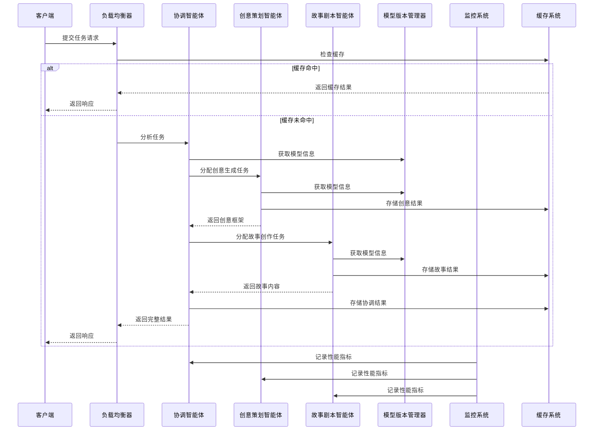

# 多智能体配置方案文档

## 1. 系统架构概览

### 1.1 架构设计

本系统采用微服务架构设计，将不同功能的智能体模块独立部署，通过统一的接口进行通信和协作。系统主要由以下组件组成：

- **协调智能体**：负责任务分析、资源分配和工作流管理
- **创意策划智能体**：负责生成故事创意框架和热点元素分析
- **故事剧本智能体**：负责故事创作和剧本编写
- **负载均衡器**：管理任务队列和智能体实例分配
- **模型版本管理器**：负责模型的版本管理和切换
- **性能监控系统**：跟踪智能体的响应时间和资源占用
- **错误处理系统**：处理异常情况和实现重试机制
- **缓存系统**：提高系统响应速度和资源利用率

### 1.2 系统流程图



## 2. 智能体角色与模型分配

### 2.1 智能体角色定义

| 智能体类型 | 角色职责 | 推荐模型 |
|----------|---------|----------|
| 协调智能体 | 任务分析、资源分配、工作流管理 | Qwen/Qwen3-235B-A22B-Instruct-2507 |
| 创意策划智能体 | 热点元素分析、故事创意生成、媒介适配 | DeepSeek |
| 故事剧本智能体 | 故事创作、剧本编写、内容质量评估 | Qwen/Qwen3-30B-A3B |

### 2.2 模型配置参数

每个智能体的模型配置参数可以在YAML配置文件中独立设置，包括以下关键参数：

- `temperature`：控制生成文本的随机性
- `top_p`：控制生成文本的多样性
- `max_tokens`：控制生成文本的最大长度
- `timeout`：控制模型请求的超时时间
- `retry_attempts`：控制模型请求失败后的重试次数

## 3. 配置系统设计

### 3.1 配置文件结构

系统使用YAML格式的配置文件管理智能体和模型配置，配置文件位于`config/templates/agent_config.yaml`：

```yaml
# 智能体配置模板
agents:
  coordination:
    model: Qwen/Qwen3-235B-A22B-Instruct-2507
    parameters:
      temperature: 0.7
      top_p: 0.9
      max_tokens: 2048
      timeout: 30
    max_instances: 2
  creative:
    model: DeepSeek
    parameters:
      temperature: 0.8
      top_p: 0.95
      max_tokens: 4096
      timeout: 60
    max_instances: 3
  story_script:
    model: Qwen/Qwen3-30B-A3B
    parameters:
      temperature: 0.7
      top_p: 0.9
      max_tokens: 8192
      timeout: 90
    max_instances: 3

# 系统配置
system:
  load_balancing_strategy: priority
  monitoring_interval: 10
  cache_ttl: 3600
  retry_max_attempts: 3
  retry_backoff_factor: 2
```

### 3.2 动态配置更新

系统支持通过API动态更新配置，无需重启服务：

- **更新智能体模型**：`PUT /api/config/agent/{agent_type}/model`
- **更新模型参数**：`PUT /api/config/agent/{agent_type}/parameters`
- **更新系统配置**：`PUT /api/config/system`

## 4. 模型版本管理

### 4.1 版本管理机制

系统实现了完整的模型版本管理机制，支持以下功能：

- **版本切换**：在不同版本的模型之间平滑切换
- **版本回滚**：当新版本出现问题时快速回滚到稳定版本
- **版本历史**：记录模型版本的变更历史
- **兼容性检查**：确保模型版本变更不会破坏系统功能

### 4.2 版本管理API

| API路径 | 方法 | 功能描述 |
|--------|------|----------|
| `/api/model/versions` | GET | 获取模型版本列表 |
| `/api/model/versions/{version_id}` | GET | 获取指定版本详情 |
| `/api/model/versions` | POST | 创建新版本 |
| `/api/model/versions/{version_id}/activate` | PUT | 激活指定版本 |
| `/api/model/versions/{version_id}/rollback` | PUT | 回滚到指定版本 |

## 5. 性能监控系统

### 5.1 监控指标

系统监控以下关键指标：

- **响应时间**：各智能体的平均响应时间和峰值响应时间
- **资源占用**：CPU使用率、内存使用率
- **任务完成率**：任务成功完成的比例
- **错误率**：各智能体的错误发生频率
- **缓存命中率**：缓存系统的命中比例

### 5.2 监控实现

- 使用装饰器`@monitor_execution_time`跟踪方法执行时间
- 使用后台线程定期收集系统资源使用情况
- 使用Redis存储监控数据，支持实时查询
- 提供监控API接口，方便外部系统集成

## 6. 错误处理与重试机制

### 6.1 错误类型

系统定义了以下错误类型：

- `ModelError`：模型执行错误
- `NetworkError`：网络连接错误
- `TimeoutError`：请求超时错误
- `ValidationError`：参数验证错误
- `ResourceError`：资源不足错误

### 6.2 重试机制

系统实现了智能的重试机制：

- 使用装饰器`@retry`自动重试可恢复的错误
- 采用指数退避策略，避免频繁重试导致系统过载
- 记录重试次数和间隔，便于问题排查
- 对不同类型的错误采用不同的重试策略

## 7. 缓存机制

### 7.1 缓存层次

系统实现了两级缓存机制：

- **内存缓存**：用于频繁访问的数据，响应速度快
- **Redis缓存**：用于持久化缓存，支持分布式部署

### 7.2 缓存策略

- **智能体响应缓存**：缓存智能体的响应结果，避免重复计算
- **任务结果缓存**：缓存任务执行结果，提高系统响应速度
- **模型配置缓存**：缓存模型配置信息，减少配置文件读取

### 7.3 缓存管理

- 自动清理过期缓存数据
- 提供缓存刷新API接口
- 监控缓存命中率，优化缓存策略

## 8. 部署与扩展指南

### 8.1 部署架构

系统支持多种部署方式：

- **单节点部署**：所有组件部署在同一台服务器上
- **多节点部署**：不同组件部署在不同服务器上
- **容器化部署**：使用Docker容器化部署，便于管理和扩展

### 8.2 扩展策略

系统设计支持水平扩展：

- **智能体实例扩展**：根据负载动态调整智能体实例数量
- **负载均衡**：使用优先级队列管理任务分配
- **服务发现**：支持新智能体实例的自动发现和注册

### 8.3 健康检查

系统实现了健康检查机制：

- 定期检查智能体实例的健康状态
- 自动隔离不健康的实例
- 当实例恢复健康后自动重新加入集群

## 9. 安全性考虑

### 9.1 访问控制

- API接口使用JWT令牌进行身份验证
- 不同角色拥有不同的权限级别
- 敏感操作需要额外的授权验证

### 9.2 数据安全

- 缓存数据加密存储
- 日志中屏蔽敏感信息
- 定期备份配置和状态数据

## 10. 性能优化建议

### 10.1 配置优化

- 根据硬件资源调整智能体实例数量
- 根据任务类型调整模型参数
- 合理设置缓存过期时间

### 10.2 代码优化

- 使用异步编程提高并发处理能力
- 优化数据库查询和Redis操作
- 减少网络传输数据量

### 10.3 监控与调优

- 建立性能基准，定期对比分析
- 根据监控数据调整系统配置
- 识别性能瓶颈，有针对性地进行优化

## 11. 故障排查指南

### 11.1 常见问题

| 问题现象 | 可能原因 | 解决方案 |
|---------|---------|----------|
| 智能体响应超时 | 模型执行时间过长 | 调整timeout参数，优化模型配置 |
| 任务执行失败 | 模型错误或网络问题 | 检查模型状态，查看网络连接 |
| 系统响应缓慢 | 缓存命中率低或负载过高 | 优化缓存策略，增加智能体实例 |
| 内存使用率高 | 缓存数据过多或内存泄漏 | 调整缓存大小，检查代码逻辑 |

### 11.2 日志分析

系统生成详细的日志信息，包括：

- 智能体执行日志
- 错误处理日志
- 性能监控日志
- 缓存操作日志

通过分析这些日志，可以快速定位和解决系统问题。

## 12. 总结

本多智能体配置方案文档详细描述了系统的架构设计、智能体配置、模型管理、性能监控、错误处理和缓存机制等方面。通过合理的配置和优化，可以实现系统的高性能、高可靠性和高可扩展性，满足多智能体协作的需求。

系统采用模块化设计，各组件之间通过标准化的接口进行通信，便于维护和扩展。同时，系统提供了丰富的监控和管理工具，便于运维人员实时了解系统状态和进行问题排查。

通过本方案的实施，可以构建一个高效、可靠、可扩展的多智能体协作系统，为用户提供优质的故事创作和内容生成服务。