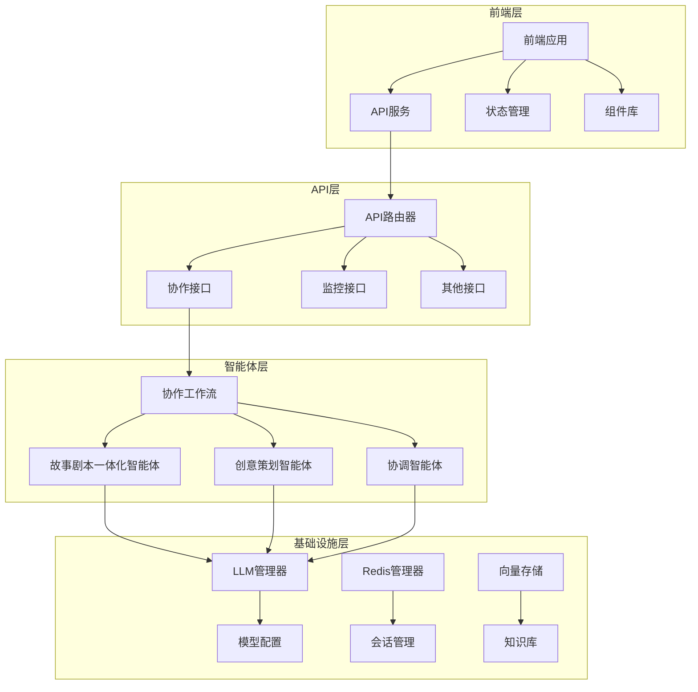
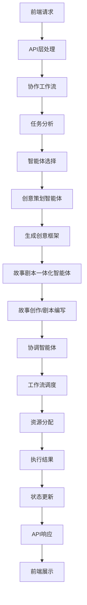

# 系统架构调整文档

## 1. 调整背景

根据提供的设计图片，我们对现有系统架构进行了系统性调整，将"小说创作智能体"改造为"故事剧本一体化智能体"，合并协调智能体功能，调整智能体交互逻辑和数据流转机制，以实现更高效、更灵活的故事剧本创作和协调调度功能。

## 2. 调整内容

### 2.1 智能体改造

#### 2.1.1 故事剧本一体化智能体

- **改造前**：小说创作智能体 (`NovelWritingAgent`)，仅支持小说创作
- **改造后**：故事剧本一体化智能体 (`StoryScriptAgent`)，支持小说创作和剧本编写

**核心功能增强**：
- 支持多种文风类型：甜宠风格、悬疑风格、逆袭风格、都市风格、奇幻风格
- 支持多种媒介类型：小说、电影剧本、舞台剧剧本、短剧剧本
- 新增故事架构设计功能
- 新增角色塑造和人物弧光构建功能
- 新增冲突设计功能
- 新增多媒介适配功能
- 新增内容质量评估功能

#### 2.1.2 协调智能体

- **改造前**：两个独立的协调智能体，功能分散
- **改造后**：单一协调智能体 (`CoordinationAgent`)，合并现有调度功能

**核心功能增强**：
- 任务分析和规划
- 工作流调度和资源分配
- 冲突检测和解决
- 智能体工作流适配
- 工作流调度日志生成
- 异常处理报告生成

### 2.2 智能体交互逻辑调整

- **改造前**：简单的线性智能体调用
- **改造后**：基于 LangGraph 的智能体协作工作流

**调整内容**：
- 实现思考-行动循环的 React 范式
- 支持智能体之间的双向通信
- 实现智能体状态的实时同步
- 支持工作流的动态调整

### 2.3 数据流转机制调整

- **改造前**：简单的参数传递
- **改造后**：基于状态管理的数据流转

**调整内容**：
- 实现统一的协作状态管理 (`CollaborationState`)
- 支持请求参数的传递和使用
- 实现执行历史和反思记录的存储
- 支持智能体状态的实时更新

### 2.4 前端功能改造

- **改造前**：仅支持小说创作功能
- **改造后**：支持故事剧本创作和协调智能体交互功能

**调整内容**：
- 新增文风类型选择
- 新增媒介类型选择
- 新增章节/场景数量设置
- 新增故事剧本创作状态显示
- 新增协调智能体工作流状态显示

## 3. 系统架构图

### 3.1 模块关系图



### 3.2 数据流图



## 4. 技术实现

### 4.1 后端实现

#### 4.1.1 智能体实现

- **StoryScriptAgent**：实现故事和剧本创作功能
- **CoordinationAgent**：实现任务协调和工作流调度功能
- **CreativePlanningAgent**：实现创意策划功能

#### 4.1.2 工作流实现

- **collaboration_workflow**：基于 LangGraph 实现智能体协作工作流
- **CollaborationState**：实现协作状态的管理和流转

#### 4.1.3 API实现

- **/api/collaboration/collaborate**：智能体协作接口
- **/api/collaboration/status/{session_id}**：协作状态查询接口
- **/api/collaboration/cancel/{session_id}**：协作取消接口
- **/api/monitoring/data**：监控数据接口

### 4.2 前端实现

#### 4.2.1 组件实现

- **ExecutionControl**：执行控制组件，支持故事剧本创作参数设置
- **StatusOverview**：状态概览组件，显示工作流执行状态
- **AgentStatus**：智能体状态组件，显示智能体运行状态
- **ExecutionHistory**：执行历史组件，显示工作流执行历史
- **WorkflowDetails**：工作流详情组件，显示工作流执行详情

#### 4.2.2 服务实现

- **workflowService**：工作流服务，处理工作流执行请求
- **monitoringService**：监控服务，获取监控数据

#### 4.2.3 状态管理

- **workflowStore**：工作流状态管理，存储执行参数
- **monitoringStore**：监控状态管理，存储监控数据

## 5. 接口设计

### 5.1 协作接口

#### 5.1.1 请求参数

```json
{
  "task_goal": "生成一个关于人工智能的故事创意，并创作故事剧本",
  "session_id": "user_123",
  "model": "deepseek-chat",
  "timeout": 300,
  "priority": 3,
  "writing_style": "urban",
  "medium_type": "novel",
  "chapter_count": 5
}
```

#### 5.1.2 响应参数

```json
{
  "session_id": "user_123",
  "task_goal": "生成一个关于人工智能的故事创意，并创作故事剧本",
  "workflow_state": "completed",
  "result": {
    "execution_history": [],
    "reflection_records": [],
    "agent_states": {}
  },
  "error": null,
  "execution_history": [],
  "reflection_records": []
}
```

### 5.2 监控接口

#### 5.2.1 响应参数

```json
{
  "totalTasks": 10,
  "successTasks": 7,
  "failedTasks": 1,
  "runningTasks": 2,
  "avgExecutionTime": "45s",
  "agentStatuses": {
    "creative": "可用",
    "story_script": "可用",
    "scheduler": "可用"
  },
  "executionHistory": []
}
```

## 6. 部署和配置

### 6.1 后端部署

- **依赖项**：FastAPI、LangChain、LangGraph、Redis、Chromadb
- **配置文件**：`.env` 文件，包含模型API密钥和Redis配置
- **启动命令**：`uvicorn main:app --reload`

### 6.2 前端部署

- **依赖项**：Vue 3、Ant Design Vue、Pinia、Axios
- **配置文件**：`vite.config.js`，包含开发服务器配置
- **启动命令**：`npm run dev`
- **构建命令**：`npm run build`

## 7. 测试和验证

### 7.1 功能测试

- **故事剧本创作测试**：测试不同文风类型和媒介类型的创作功能
- **协调智能体测试**：测试任务处理效率和资源分配合理性
- **智能体协作测试**：测试智能体之间的交互和协作

### 7.2 性能测试

- **响应时间测试**：测试API接口的响应时间
- **并发测试**：测试系统在并发请求下的性能
- **资源使用测试**：测试系统的CPU和内存使用情况

### 7.3 稳定性测试

- **长时间运行测试**：测试系统在长时间运行下的稳定性
- **错误处理测试**：测试系统在错误情况下的处理能力
- **恢复测试**：测试系统在故障后的恢复能力

## 8. 结论和建议

### 8.1 结论

本次系统架构调整成功实现了以下目标：

- 将"小说创作智能体"改造为"故事剧本一体化智能体"，实现了故事和剧本创作功能
- 合并协调智能体功能，实现了统一的任务协调和工作流调度
- 调整了智能体交互逻辑和数据流转机制，实现了更高效、更灵活的智能体协作
- 改造了前端功能，实现了故事剧本创作和协调智能体交互功能

### 8.2 建议

- **进一步优化**：可以考虑添加更多的智能体类型，如市场分析智能体、内容审核智能体等
- **扩展功能**：可以考虑添加视频制作功能，实现从故事创作到视频制作的全流程
- **性能优化**：可以考虑使用缓存机制，提高系统的响应速度
- **安全性**：可以考虑添加API认证和授权机制，提高系统的安全性

## 9. 版本控制

| 版本号 | 调整日期 | 调整内容 | 影响范围 |
|--------|----------|----------|----------|
| v1.1.0 | 2026-01-28 | 故事剧本一体化智能体改造，协调智能体合并，前端功能改造 | 全系统 |
| v1.0.0 | 2026-01-28 | 初始版本，实现基本功能 | 全系统 |
