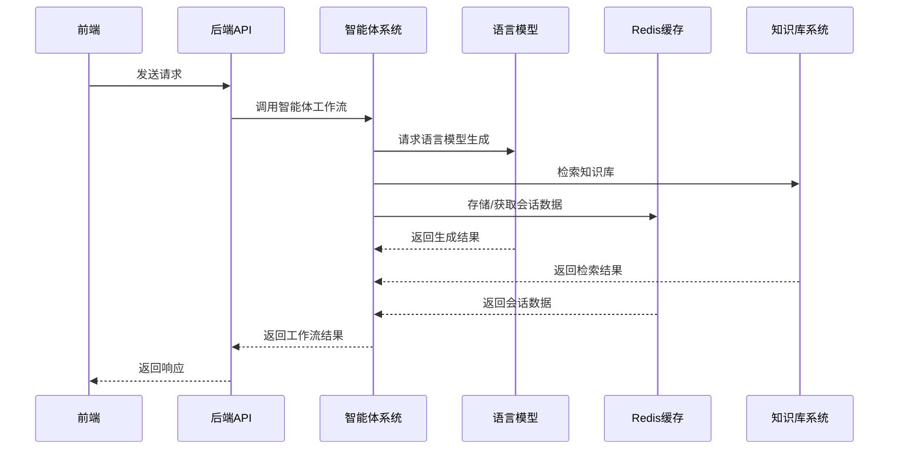
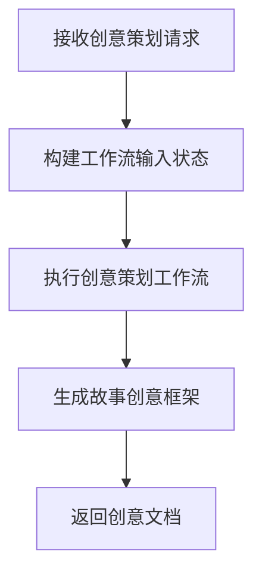
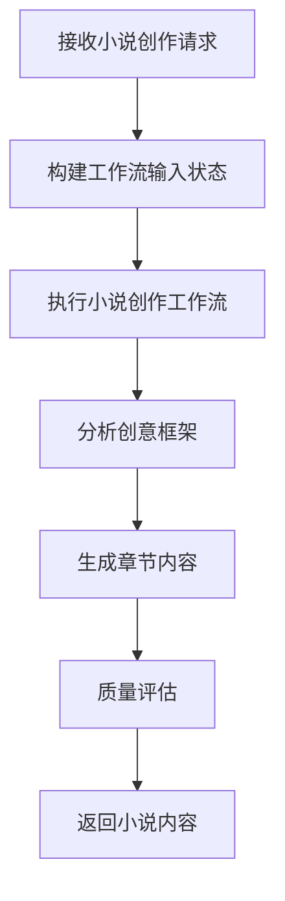
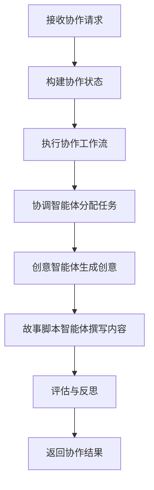
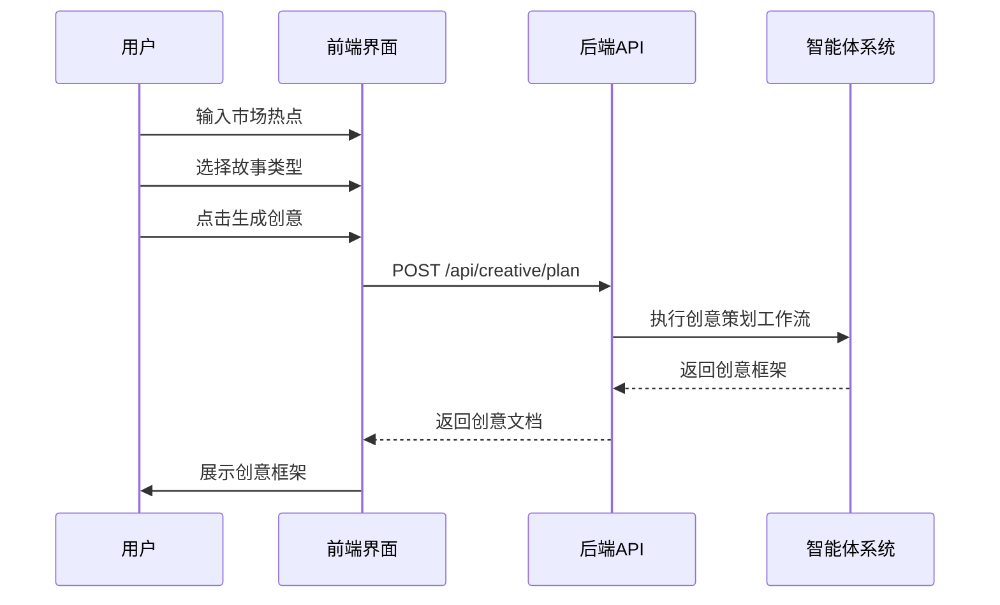
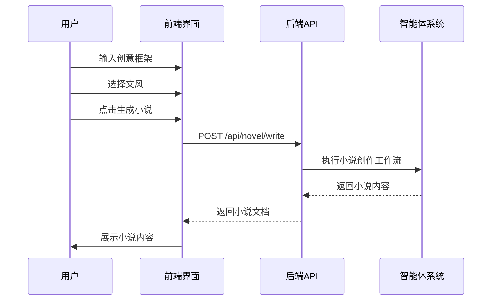
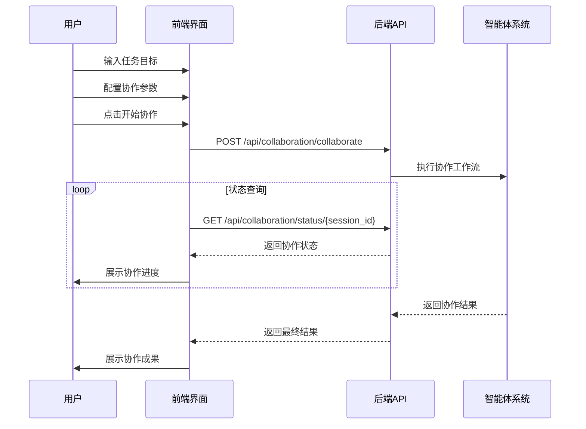

# 小说创作智能体系统功能分析与设计文档

## 1. 系统架构概述

### 1.1 技术栈

| 类别 | 技术 | 版本 | 用途 |
|------|------|------|------|
| 前端 | React | 18 | 用户界面构建 |
| 前端 | TypeScript | 5.0+ | 类型安全 |
| 前端 | React Router | 6.0+ | 路由管理 |
| 前端 | Redux Toolkit | 1.9+ | 状态管理 |
| 前端 | Ant Design | 5.0+ | UI组件库 |
| 前端 | Tailwind CSS | 3.0+ | 样式管理 |
| 前端 | Vite | 4.0+ | 构建工具 |
| 前端 | Axios | 1.0+ | HTTP请求 |
| 后端 | FastAPI | 0.100+ | API框架 |
| 后端 | LangChain | 0.1.0+ | 语言模型链 |
| 后端 | LangGraph | 0.1.0+ | 智能体协作 |
| 后端 | Redis | 7.0+ | 缓存与会话管理 |
| 后端 | Python | 3.9+ | 后端开发语言 |

### 1.2 系统架构图



## 2. 后端系统功能分析

### 2.1 核心业务模块

| 模块 | 功能描述 | 文件路径 | 关键接口 |
|------|----------|----------|----------|
| 创意策划 | 基于市场热点生成故事创意框架 | backend/api/creative.py | POST /api/creative/plan |
| 小说创作 | 基于创意框架撰写小说 | backend/api/novel.py | POST /api/novel/write |
| 智能体协作 | 多智能体协同完成复杂任务 | backend/api/collaboration.py | POST /api/collaboration/collaborate |
| 对话系统 | 多轮对话交互 | backend/api/chat.py | POST /api/chat |
| 知识库管理 | 文档上传与检索 | backend/api/knowledge.py | POST /api/upload, GET /api/knowledge/status |
| 系统监控 | 系统状态与工作流监控 | backend/api/monitoring.py | GET /api/monitoring/status |
| 工作流调度 | 智能体任务调度 | backend/api/scheduler.py | POST /api/scheduler/schedule |

### 2.2 数据模型设计

#### 2.2.1 请求模型

| 模型名称 | 描述 | 关键字段 | 用途 |
|----------|------|----------|------|
| ChatRequest | 对话请求 | message, session_id, use_knowledge, model | 处理用户对话请求 |
| CreativePlanningRequest | 创意策划请求 | hotspots, story_type, session_id, model | 生成故事创意框架 |
| NovelWritingRequest | 小说创作请求 | creative_framework, style, chapter_count, session_id, model | 生成小说内容 |
| CollaborationRequest | 协作请求 | task_goal, session_id, model, timeout, priority, writing_style, medium_type, chapter_count | 启动多智能体协作 |

#### 2.2.2 响应模型

| 模型名称 | 描述 | 关键字段 | 用途 |
|----------|------|----------|------|
| ChatResponse | 对话响应 | response, session_id, sources | 返回对话回复 |
| CreativePlanningResponse | 创意策划响应 | response, session_id, creative_document, story_framework, sources | 返回创意框架 |
| NovelWritingResponse | 小说创作响应 | response, session_id, novel_content, chapters, quality_evaluation, word_count, style_used | 返回生成的小说 |
| CollaborationResponse | 协作响应 | session_id, task_goal, workflow_state, result, error, execution_history, reflection_records | 返回协作结果 |
| NovelChaptersResponse | 小说章节响应 | session_id, chapters, message | 返回小说章节 |
| NovelExportResponse | 小说导出响应 | session_id, format, message | 返回导出结果 |
| CollaborationStatusResponse | 协作状态响应 | session_id, status, message | 返回协作状态 |
| CollaborationCancelResponse | 协作取消响应 | session_id, status, message | 返回取消结果 |

### 2.3 API接口规范

#### 2.3.1 创意策划API

| 接口路径 | 方法 | 功能描述 | 请求参数 | 成功响应 |
|----------|------|----------|----------|----------|
| /api/creative/plan | POST | 生成故事创意框架 | hotspots: List[str], story_type: str, session_id: str, model: str | CreativePlanningResponse |

#### 2.3.2 小说创作API

| 接口路径 | 方法 | 功能描述 | 请求参数 | 成功响应 |
|----------|------|----------|----------|----------|
| /api/novel/write | POST | 生成小说内容 | creative_framework: str, style: str, chapter_count: int, session_id: str, model: str | NovelWritingResponse |
| /api/novel/chapters/{session_id} | GET | 获取小说章节 | session_id: str | NovelChaptersResponse |
| /api/novel/export/{session_id} | POST | 导出小说 | session_id: str, format: str | NovelExportResponse |

#### 2.3.3 智能体协作API

| 接口路径 | 方法 | 功能描述 | 请求参数 | 成功响应 |
|----------|------|----------|----------|----------|
| /api/collaboration/collaborate | POST | 启动多智能体协作 | task_goal: str, session_id: str, model: str, timeout: int, priority: int, writing_style: str, medium_type: str, chapter_count: int | CollaborationResponse |
| /api/collaboration/status/{session_id} | GET | 获取协作状态 | session_id: str | CollaborationStatusResponse |
| /api/collaboration/cancel/{session_id} | POST | 取消协作 | session_id: str | CollaborationCancelResponse |

#### 2.3.4 对话API

| 接口路径 | 方法 | 功能描述 | 请求参数 | 成功响应 |
|----------|------|----------|----------|----------|
| /api/chat | POST | 处理对话请求 | message: str, session_id: str, use_knowledge: bool, model: str | ChatResponse |

#### 2.3.5 知识库API

| 接口路径 | 方法 | 功能描述 | 请求参数 | 成功响应 |
|----------|------|----------|----------|----------|
| /api/upload | POST | 上传文档到知识库 | file: UploadFile | FileUploadResponse |
| /api/knowledge/status | GET | 获取知识库状态 | 无 | KnowledgeBaseStatus |
| /api/knowledge/clear | POST | 清空知识库 | 无 | ClearKnowledgeBaseResponse |

#### 2.3.6 监控API

| 接口路径 | 方法 | 功能描述 | 请求参数 | 成功响应 |
|----------|------|----------|----------|----------|
| /api/monitoring/status | GET | 获取系统状态 | 无 | 系统状态信息 |
| /api/monitoring/workflow/{workflow_id} | GET | 获取工作流详情 | workflow_id: str | 工作流详情 |

### 2.4 权限控制机制

- **当前实现**: 无权限控制，所有API均可直接访问
- **建议实现**: 
  - JWT令牌认证
  - 基于角色的访问控制(RBAC)
  - API密钥验证

### 2.5 数据持久化方案

| 数据类型 | 存储方式 | 实现细节 | 文件路径 |
|----------|----------|----------|----------|
| 对话历史 | Redis | 存储在Redis哈希表中，会话ID作为键 | backend/core/redis.py |
| 智能体状态 | Redis | 存储在Redis哈希表中，会话ID作为键 | backend/core/redis.py |
| 知识库 | 向量数据库 | 使用ChromaDB存储向量嵌入 | backend/rag/retriever.py |
| 工作流日志 | 本地文件 | 存储为JSON格式文件 | backend/core/monitoring.py |

### 2.6 业务逻辑实现

#### 2.6.1 创意策划工作流



**核心逻辑**: `backend/agent/workflow.py` 中的 `creative_workflow`，使用LangGraph构建的工作流，包含市场分析、创意生成等步骤。

#### 2.6.2 小说创作工作流



**核心逻辑**: `backend/agent/workflow.py` 中的 `novel_workflow`，使用LangGraph构建的工作流，包含章节规划、内容生成、质量评估等步骤。

#### 2.6.3 智能体协作工作流



**核心逻辑**: `backend/agent/collaboration_workflow.py` 中的 `collaboration_workflow`，使用LangGraph构建的多智能体协作工作流，包含协调智能体、创意智能体、故事脚本智能体等。

## 3. 前端系统功能设计

### 3.1 页面结构

| 页面 | 功能描述 | 文件路径 | 关键组件 |
|------|----------|----------|----------|
| 仪表盘 | 系统概览、智能体状态、执行历史 | frontend/src/pages/dashboard/index.tsx | 统计卡片、状态监控、历史记录 |
| 聊天 | 多轮对话、模型选择 | frontend/src/pages/chat/index.tsx | 消息列表、输入框、模型选择 |
| 创意策划 | 热点输入、创意框架生成 | frontend/src/pages/creative/index.tsx | 热点输入、参数设置、创意展示 |
| 小说创作 | 创意框架输入、小说生成 | frontend/src/pages/novel/index.tsx | 框架输入、参数设置、小说展示 |
| 协作 | 任务目标输入、协作状态监控 | frontend/src/pages/collaboration/index.tsx | 目标输入、参数设置、状态监控 |
| 知识库 | 知识库管理、文档上传 | frontend/src/pages/knowledge/index.tsx | 知识条目列表、搜索、CRUD操作 |
| 设置 | 系统配置、应用设置 | frontend/src/pages/settings/index.tsx | 表单设置、主题配置、语言设置 |

### 3.2 组件设计

| 组件 | 功能描述 | 文件路径 | 关键属性 |
|------|----------|----------|----------|
| 侧边栏 | 导航菜单 | frontend/src/components/layout/Sidebar.tsx | 菜单列表、当前路径 |
| 头部 | 顶部导航 | frontend/src/components/layout/Header.tsx | 标题、用户信息 |
| 布局 | 主布局 | frontend/src/components/layout/Layout.tsx | 侧边栏、头部、内容区 |
| 统计卡片 | 数据展示 | frontend/src/components/common/StatCard.tsx | 标题、值、图标 |
| 加载指示器 | 加载状态 | frontend/src/components/common/Loading.tsx | 加载文本 |
| 错误边界 | 错误处理 | frontend/src/components/common/ErrorBoundary.tsx | 错误信息 |

### 3.3 交互流程设计

#### 3.3.1 创意策划流程



#### 3.3.2 小说创作流程



#### 3.3.3 智能体协作流程



### 3.4 响应式布局设计

| 设备类型 | 布局策略 | 实现细节 |
|----------|----------|----------|
| 桌面端 | 三栏布局 | 侧边栏(256px) + 内容区(自适应) + 右侧面板(300px) |
| 平板端 | 两栏布局 | 侧边栏(200px) + 内容区(自适应)，右侧面板折叠 |
| 移动端 | 单栏布局 | 侧边栏抽屉式，内容区全屏，顶部导航简化 |

**实现方式**: 使用Tailwind CSS的响应式断点，结合Ant Design的Layout组件。

### 3.5 数据展示组件

| 组件名称 | 功能描述 | 实现技术 | 文件路径 |
|----------|----------|----------|----------|
| 统计卡片 | 展示关键指标 | Ant Design Card + Tailwind CSS | frontend/src/components/common/StatCard.tsx |
| 消息列表 | 展示对话历史 | Ant Design List + Tailwind CSS | frontend/src/pages/chat/index.tsx |
| 创意框架展示 | 展示故事创意框架 | Ant Design Tabs + Tailwind CSS | frontend/src/pages/creative/index.tsx |
| 小说内容展示 | 展示生成的小说 | Ant Design Typography + Tailwind CSS | frontend/src/pages/novel/index.tsx |
| 协作状态监控 | 展示协作进度 | Ant Design Progress + Timeline | frontend/src/pages/collaboration/index.tsx |
| 知识条目列表 | 展示知识库条目 | Ant Design Table + Tailwind CSS | frontend/src/pages/knowledge/index.tsx |

### 3.6 用户操作反馈

| 操作类型 | 反馈方式 | 实现技术 |
|----------|----------|----------|
| 按钮点击 | 加载状态 + 成功/失败提示 | Ant Design Button + message |
| 表单提交 | 加载状态 + 成功/失败提示 | Ant Design Form + message |
| API请求 | 全局加载状态 + 错误提示 | Axios拦截器 + Ant Design message |
| 页面切换 | 路由过渡动画 | React Router + CSS动画 |

### 3.7 后端API集成

| API模块 | 前端集成方式 | 文件路径 | 关键函数 |
|----------|--------------|----------|----------|
| 创意策划API | 封装为React Hook | frontend/src/services/api.ts | `createCreativePlan` |
| 小说创作API | 封装为React Hook | frontend/src/services/api.ts | `writeNovel` |
| 智能体协作API | 封装为React Hook | frontend/src/services/api.ts | `startCollaboration` |
| 对话API | 封装为React Hook | frontend/src/services/api.ts | `sendChatMessage` |
| 知识库API | 封装为React Hook | frontend/src/services/api.ts | `uploadFile` |
| 监控API | 封装为React Hook | frontend/src/services/api.ts | `getSystemStatus` |

**API集成实现**: 使用Axios创建实例，配置基础URL、超时、拦截器等，然后封装为React Hook供组件使用。

## 4. 前后端功能匹配分析

### 4.1 功能映射表

| 后端功能 | 前端对应功能 | 实现状态 |
|----------|--------------|----------|
| 创意策划API | 创意策划页面 | 已实现 |
| 小说创作API | 小说创作页面 | 已实现 |
| 智能体协作API | 协作页面 | 已实现 |
| 对话API | 聊天页面 | 已实现 |
| 知识库API | 知识库页面 | 已实现 |
| 监控API | 仪表盘页面 | 已实现 |
| 系统配置 | 设置页面 | 已实现 |

### 4.2 集成测试方案

| 测试场景 | 测试步骤 | 预期结果 |
|----------|----------|----------|
| 创意策划流程 | 1. 输入热点元素<br>2. 选择故事类型<br>3. 点击生成 | 成功生成创意框架 |
| 小说创作流程 | 1. 输入创意框架<br>2. 选择文风<br>3. 点击生成 | 成功生成小说内容 |
| 智能体协作流程 | 1. 输入任务目标<br>2. 配置参数<br>3. 点击开始协作 | 成功启动协作并返回结果 |
| 对话流程 | 1. 输入消息<br>2. 点击发送 | 成功返回对话回复 |
| 知识库操作 | 1. 上传文档<br>2. 查看知识库状态 | 成功上传并更新知识库 |
| 系统监控 | 1. 访问仪表盘<br>2. 查看系统状态 | 成功显示系统信息 |

## 5. 技术实现要点

### 5.1 前端技术要点

1. **状态管理**: 使用Redux Toolkit管理全局状态，包括用户配置、API响应等
2. **路由管理**: 使用React Router v6实现页面导航，支持嵌套路由和懒加载
3. **组件设计**: 采用原子设计模式，从基础组件到页面组件分层设计
4. **样式管理**: 结合Ant Design和Tailwind CSS，实现美观且响应式的UI
5. **API集成**: 使用Axios封装API调用，实现请求拦截、响应处理和错误管理
6. **性能优化**: 实现组件懒加载、虚拟滚动、缓存策略等性能优化措施

### 5.2 后端技术要点

1. **工作流设计**: 使用LangGraph构建智能体工作流，实现复杂任务的分解和执行
2. **模型管理**: 使用LangChain的模型管理功能，支持多种语言模型的切换和配置
3. **缓存策略**: 使用Redis缓存对话历史、智能体状态等数据，提高系统响应速度
4. **错误处理**: 实现全局错误处理机制，统一处理异常并返回标准错误响应
5. **监控系统**: 实现工作流监控和系统状态监控，便于问题排查和性能优化
6. **扩展性设计**: 采用模块化设计，便于添加新的智能体和功能模块

## 6. 系统部署与维护

### 6.1 部署方案

| 组件 | 部署方式 | 配置要求 |
|------|----------|----------|
| 前端 | 静态文件部署 | Nginx/Apache，支持HTTPS |
| 后端 | 容器化部署 | Docker，4GB+内存，2核+CPU |
| Redis | 容器化部署 | Docker，1GB+内存 |
| 知识库 | 本地存储 | 足够的磁盘空间 |

### 6.2 维护策略

1. **日志管理**: 实现结构化日志，便于问题排查
2. **监控告警**: 配置系统监控和告警机制，及时发现问题
3. **备份策略**: 定期备份知识库和关键配置
4. **更新机制**: 实现平滑更新，减少系统 downtime
5. **故障恢复**: 制定故障恢复预案，确保系统稳定运行

## 7. 总结与展望

### 7.1 系统功能总结

- **完整的小说创作流程**: 从创意策划到小说生成的全流程支持
- **多智能体协作**: 利用LangGraph实现智能体之间的协同工作
- **知识库增强**: 集成RAG技术，提高生成内容的准确性和相关性
- **用户友好界面**: 基于Ant Design和Tailwind CSS的现代化UI
- **可扩展性**: 模块化设计，便于添加新功能和智能体

### 7.2 未来发展方向

1. **多语言支持**: 扩展支持多语言小说创作
2. **多模态生成**: 集成图像生成功能，支持小说插画
3. **社区功能**: 添加用户社区，支持作品分享和评论
4. **高级编辑工具**: 增强小说编辑功能，支持更精细的内容修改
5. **商业化功能**: 添加订阅制、付费模板等商业化功能
6. **AI辅助工具**: 开发更多AI辅助工具，如角色生成器、情节规划器等

### 7.3 技术创新点

1. **多智能体协作框架**: 使用LangGraph构建的智能体协作系统，实现复杂任务的分解和执行
2. **工作流可视化**: 实现工作流执行过程的可视化监控
3. **自适应参数调整**: 根据任务类型自动调整模型参数，提高生成质量
4. **上下文感知对话**: 利用Redis存储对话历史，实现上下文感知的多轮对话
5. **实时状态更新**: 使用WebSocket实现智能体协作状态的实时更新

## 8. 附录

### 8.1 关键API文档

#### 8.1.1 创意策划API

**请求示例**:
```json
POST /api/creative/plan
Content-Type: application/json

{
  "hotspots": ["人工智能", "职场压力", "都市情感"],
  "story_type": "都市情感",
  "session_id": "user_123",
  "model": "deepseek-chat"
}
```

**响应示例**:
```json
{
  "response": "《故事创意框架》文档已生成",
  "session_id": "user_123",
  "creative_document": "# 《AI时代的情感抉择》故事创意框架\n\n## 1. 人物设定\n...",
  "story_framework": null,
  "sources": []
}
```

#### 8.1.2 小说创作API

**请求示例**:
```json
POST /api/novel/write
Content-Type: application/json

{
  "creative_framework": "# 《AI时代的情感抉择》故事创意框架\n...",
  "style": "sweet",
  "chapter_count": 5,
  "session_id": "user_123",
  "model": "deepseek-chat"
}
```

**响应示例**:
```json
{
  "response": "《爆款短篇小说》已生成",
  "session_id": "user_123",
  "novel_content": "# 第一章 邂逅\n\n林雨晴站在公司楼下...",
  "chapters": null,
  "quality_evaluation": null,
  "word_count": 8000,
  "style_used": "sweet"
}
```

#### 8.1.3 智能体协作API

**请求示例**:
```json
POST /api/collaboration/collaborate
Content-Type: application/json

{
  "task_goal": "生成一个关于人工智能的故事创意，并撰写短篇小说",
  "session_id": "user_123",
  "model": "qwen3-30b-a3b",
  "timeout": 300,
  "priority": 3,
  "writing_style": "urban",
  "medium_type": "novel",
  "chapter_count": 5
}
```

**响应示例**:
```json
{
  "session_id": "user_123",
  "task_goal": "生成一个关于人工智能的故事创意，并撰写短篇小说",
  "workflow_state": "completed",
  "result": {
    "execution_history": [...],
    "reflection_records": [...],
    "agent_states": {...}
  },
  "error": null,
  "execution_history": [...],
  "reflection_records": [...]
}
```

### 8.2 技术术语表

| 术语 | 解释 |
|------|------|
| RAG | Retrieval-Augmented Generation，检索增强生成，结合检索和生成的AI技术 |
| LLM | Large Language Model，大型语言模型，如GPT、Claude等 |
| LangChain | 用于构建基于语言模型的应用框架 |
| LangGraph | 用于构建智能体协作工作流的框架 |
| FastAPI | 基于Python的现代、快速的API框架 |
| React | 用于构建用户界面的JavaScript库 |
| TypeScript | JavaScript的超集，添加了类型系统 |
| Ant Design | 企业级UI组件库 |
| Tailwind CSS | 实用优先的CSS框架 |
| Vite | 现代前端构建工具 |
| Axios | 基于Promise的HTTP客户端 |
| Redis | 开源的内存数据结构存储，用于缓存和会话管理 |

### 8.3 参考资料

1. [FastAPI官方文档](https://fastapi.tiangolo.com/)
2. [LangChain官方文档](https://docs.langchain.com/)
3. [LangGraph官方文档](https://docs.langchain.com/langgraph/)
4. [React官方文档](https://react.dev/)
5. [Ant Design官方文档](https://ant.design/)
6. [Tailwind CSS官方文档](https://tailwindcss.com/)
7. [Redis官方文档](https://redis.io/documentation/)
